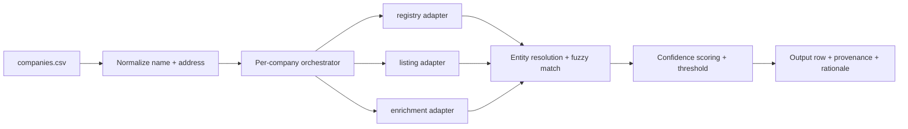

# PLAN.md 

This design reflects my experience building auditable data pipelines and enrichment systems where precision and provenance are non-negotiable — especially when the downstream use is reaching real people about money owed.

## Architecture

Per-row pipeline: CSV in → normalize → query three providers → resolve entities → score → one contact (or honest cannot-verify) out. Rows are independent and queue-friendly.

`Ingest → Normalize → Provider fan-out → Entity resolution → Scoring + threshold → Output with provenance`

- **Ingest & normalize** — parse `company_name` / `mailing_address`; canonicalize name and address; stable `company_id` for traceability.
- **Provider adapters** — uniform interface over registry, listing, enrichment; each returns signals + `source_url`. Missing data = not found, not an error.
- **Orchestrator** — fan-out per company (mock lookup now; parallel + retry + cache in production).
- **Entity resolution** — cluster candidates; fuzzy name match (nicknames, initials); normalize phone/email; detect agreement vs conflict; separate people from generic mailboxes.
- **Scoring & decision** — additive confidence, threshold → `needs_human_review`; best contact or empty when unverifiable.
- **Output** — `contact_name`, `contact_role`, `contact_email_or_phone`, `confidence_score`, `source`(s), `needs_human_review`, `source_url`s, short rationale.

The core logic is language-agnostic; a Python prototype or Laravel service layer are both viable depending on team preference.

## Sources & strategy

Triangulate — agreement across independent sources is the main confidence signal.

- **registry** — legal entity / officers / registered agent; strong name/role anchor. Often missing for tiny firms; registered agent may not be who pays the bill.
- **listing** — business phone, sometimes a name. Weak when generic, partial ("Jeff (manager)"), or stale.
- **enrichment** — email/phone candidate + `provider_confidence`. Weak when guessed or generic (`info@`, `office@`).

Strategy: registry anchors identity/role; listing corroborates + phone; enrichment adds reachability. Prefer Owner/President/CFO/AP/office manager over registered agents and role mailboxes.

## Quality

- **Dedupe** — normalize names (suffixes, nicknames, initials), emails, phones; cluster per company; cross-source match = agreement.
- **Confidence scoring** — transparent additive score (0–100). Registry weighs heaviest for identity; cross-source agreement gives a strong boost. Enrichment `provider_confidence` is treated as secondary and only counts when corroborated. Conflicts, single-source, or generic mailboxes are capped or flagged.
- **Mock intuition** — Pioneer / Ironclad / Brookside (multi-source agreement) should score high; Riverside / Summit / Hometown (weak lone enrichment) → review; Coastal Breeze (conflicting names) → review; absent rows (~12/30) → cannot-verify, score 0.
- **Provenance** — no field without a `source_url`; list providers + one-line why.
- **Cannot-verify** — no data, under threshold, or unresolved conflict → empty contact, never fabricated.
- **False positives** — wrong person on a debt outreach is the costly failure; bias to precision and human review over filling gaps.

## Privacy / compliance

- **Will**: mocks only; minimal business-context PII; provenance for audit; human review below threshold; respectful outreach framing.
- **Will NOT**: real scraping, ToS bypass, fabricated contacts, excess retention. Honor suppression lists; FDCPA-style and GDPR/CCPA constraints (details TBD).

## Clarifying questions

1. **Persona priority & acceptable fallback** — priority order among Owner, CFO, AP manager, office manager — and is an **AP manager / billing contact** (named or via `accounts@` / main business line) a first-class target when no owner is found? For collections, that persona often controls payment more than the owner on paper.
   - Why it matters: drives role weighting and whether phone-only / generic-mailbox rows (Maple Leaf, Sunbelt, Hometown) are acceptable hits vs review-only.
   - Default assumption: Owner/President first; **AP manager / billing contact is a high-value equal** when identifiable; verified business phone OK as fallback; generic mailbox alone → `needs_human_review`.
   - What changes if answered: elevating AP/billing widens valid hits and lowers review volume; owner-only tightens scoring and flags more rows.
2. **Confidence threshold & success metric (precision vs recall)** — what threshold defines `needs_human_review`, and do we optimize for precision or recall?
   - Why it matters: sets false-positive rate and review load across ~1,000 accounts.
   - Default assumption: threshold ~70, precision-first; weak lone enrichment and conflicts always flag.
   - What changes if answered: lower threshold / recall → more auto-emits; higher / precision → more review, possibly require multi-source agreement.
3. **Allowed sources & verification** — which sources are in scope, and is deliverability/line verification required or is provider confidence enough?
   - Why it matters: source trust weights and whether enrichment emails ship as-is.
   - Default assumption: registry > listing > enrichment; no live verification in slice; generic mailbox alone never auto-emits.
   - What changes if answered: verification step + higher scores for verified channels; disallowed sources → more cannot-verify.
4. **Conflict handling & output shape** — one contact per company or ranked list; on Coastal Breeze-style name conflict, emit flagged best guess, multiple candidates, or cannot-verify?
   - Why it matters: output contract and highest-risk cases.
   - Default assumption: one contact; conflict → lowered score + `needs_human_review`, not a silent pick.
   - What changes if answered: multi-contact output turns conflicts into ranked candidates for review.
